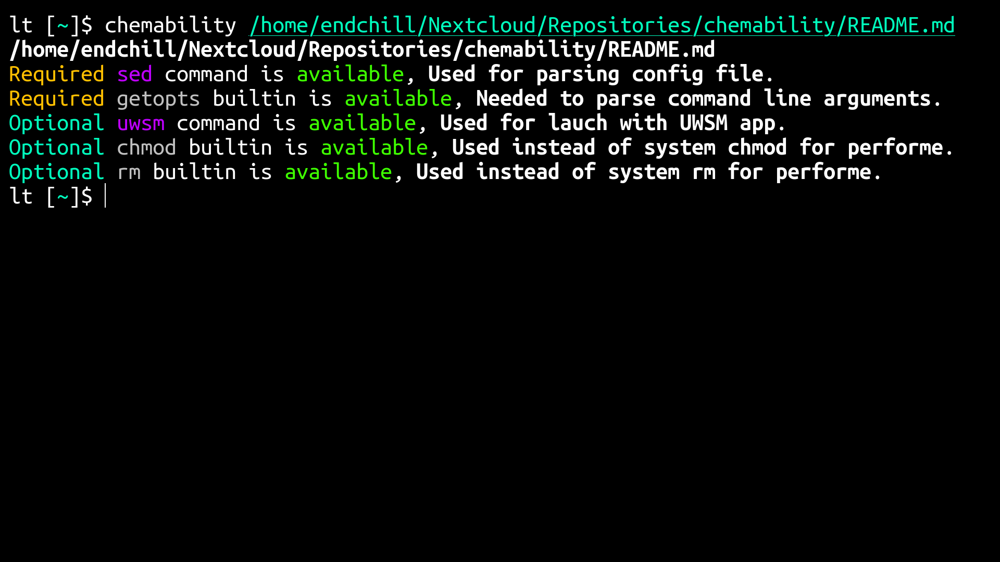

# Chemability

## Overview

Chemability is a POSIX script that scans other POSIX and non-POSIX scripts containing commented identifiers with required and optional commands/builtins.
Note that builtins checks will only work on Bash builtins.

[](https://github.com/user-attachments/assets/cbe05dc7-f7ef-432b-ad94-7c42fa04014e)

## Usage

By default if Chemability ran without arguments it will scan scripts in the current directory, Chemability can take files and directories as arguments and options `-r` for recursive scanning and `-i` for ignore pattern.
Pattern recognition is limited, only simple patterns like '*.bak' will work, make sure to quote it.


## Enabling colors

Colors can be enabled using environment variables:

* Set `CLICOLOR` to `1` to enable auto-detecting color support.
* Set `CLICOLOR_FORCE` to `1` to always force color output.

## How it works

```bash
#!/usr/bin/env bash

# There are five line identifiers you can use, each one is for a purpose.
# The syntax starts with '#CHEMA_' followed with a keyword without spaces.

# #CHEMA_REQ ...
# #CHEMA_REQ_BLT ...
# #CHEMA_OPT ...
# #CHEMA_OPT_BLT ...
# #CHEMA_END


# #CHEMA_END is not required, but it will tell the script to stop scanning the script and move on to the next file.
# it's recommended to have to make Chemability perform better for scanning a directory with a bunch of scripts.

# #CHEMA_REQ contains required commands needed for the script to work, #CHEMA_REQ_BLT is the same thing, but for Bash builtins.

# #CHEMA_OPT contains optional commands needed for some functionality to work, #CHEMA_OPT_BLT is the same thing, but for Bash builtins.

# The syntax is the same for the last four, commands/builtins separated by ',' Chemability will trim spaces and tabs.
# you can add a comment to a command/builtin by adding ';' after the command/builtin then the comment, Chemability will also trim spaces and tabs for comments.
```

## Example

Below is an example of a script with Chemability identifiers.

```bash
#!/usr/bin/env bash

#CHEMA_REQ sed; Used for parsing config file
#CHEMA_REQ_BLT getopts; Needed to parse command line arguments
#CHEMA_OPT uwsm; Used to launch with UWSM app
#CHEMA_OPT_BLT chmod; Used instead of system chmod for performance, rm; Used instead of system rm for performance
#CHEMA_END

...

```

The output of Chemability would be like this


